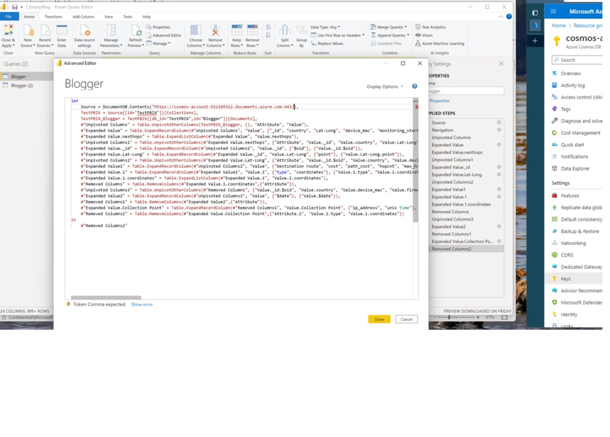

# PowerBI Incremental Update Article

## Getting Started

1. Download Power BI desktop at https://powerbi.microsoft.com/en-us/downloads/
1. Open BlogArticle.pbix with Power BI
1. Dismiss the large yellow banner, click File, then click the button labeled "Browse Reports" in the "Open Report" Dialogue.  This launches File Explorer.  Navigate to where you "git cloned" this repo and then to the PBI directory.
1. Click on the Home Ribbon, then click on Transform Data, then choose "Transform Data" from the menu
1. That opens the Power Query Editor in a new Window.  Along the top ribbon, find the "Advanced Editor" button and click it.  This opens the Advanced Editor.  All we are going to do is change the Cosmos URL in a line that looks like this:

     Source = DocumentDB.Contents("https://test-power-bi.documents.azure.com:443/")

1. The Host URL is found in the azure cli script you ran to create the Azure Cosmos DB account, database and container. You should also have this in the cosmosLoader.py file as well. You can also find this in the Azure portal in the Overview blade.
1. Click Done on the Advanced Editor. Find the yellow banner that says, Enter Credentials. Paste in the key from the azure cli script you ran or the cosmosLoader.py file as well.
1. Next, click on "Blogger (2) and repeat the same steps
1. Finally, on the left of the Ribbon is the Close and Apply.
1. Finally to see all your work, click on the Data Icon on the right to see the data.

You are now ready to follow the Article to set-up an Incremental Refresh.
