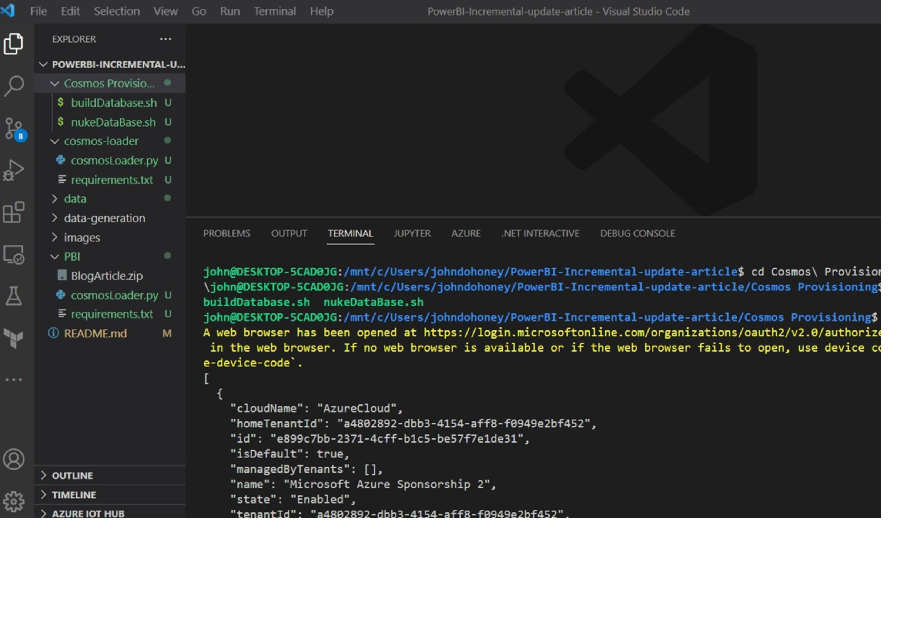
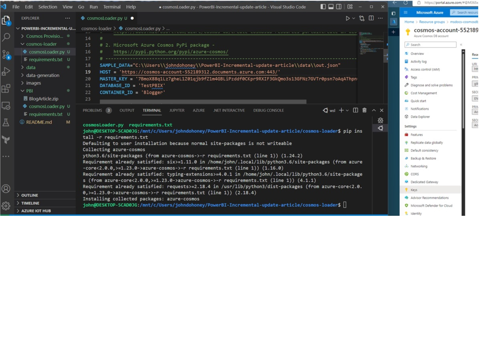
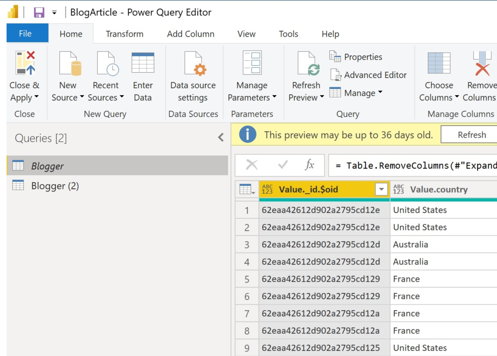

# PowerBI Incremental Update Article

This repo contains the assets for the Power PBI Incremental refresh Blog Post

## Content

### ./Cosmos Provisioning

This file will provision the Azure Resource Group and Cosmos Database.

 Once this is provisioned, you will need to access the Cosmos Database for the Host Name and Key for access.  This information needs to be filled in the the cosmosLoader.py program located in the cosmos-loader sub-directory.

### ./cosmos-loader

I used 2 shells, WSL (Ubuntu) and Powershell in Visual Studio code.  Run "pip install -r requirements.txt" to install your python dependency. Then edit the cosmosLoader.py to provide the FULL file location of out.json (in the ./data sub-directory), the Cosmos Host URL, and Cosmos key for access.  Then run the program to load 1000 records to use with Power BI. ![Load Data Check]

### ./data-generation -

This directory contains the mgenerate.js template that is capable of generating simulated data.  Find [mgenerate.js here](https://github.com/rueckstiess/mgeneratejs)

### ./data -

This is a directory that contains 2 JSON arrays of pre-generated data, both with 1000 documents.  out.json is a JSON Array, this file is used by the python program that loads the data.  Out.json is a derivitive of sample_data_1000.json -- processed with UNIX sed to add a comma at the end of each json document (end of line), and adding "[]" in the beginning and end of the document--making this a syntactically correct json array.

## ./PBI -

This contains the Power BI Desktop file that is saved in a ZIP format--unzip it, and read the directions in that directory.  

Power BI desktop can only be run on Windows architectures.  The Desktop App is a free download.  You can also get a [free Power BI System account](https://powerbi.microsoft.com/) - .  The PBIX file can be uploaded to Power BI system or opened in PowerBI desktop.  

The more interesting part of the PBI desktop file can be found in the Power Query Editor (PQE) (Started from the "Transform Data option on the Home Ribbon).  The PQE shows the steps to flatten the embedded document for reporting--all in place.  All of the detailed steps are contained on the right pane in the PQE editor.

